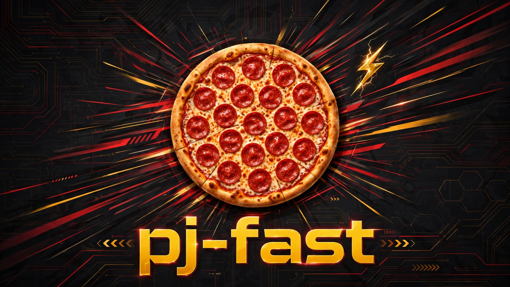
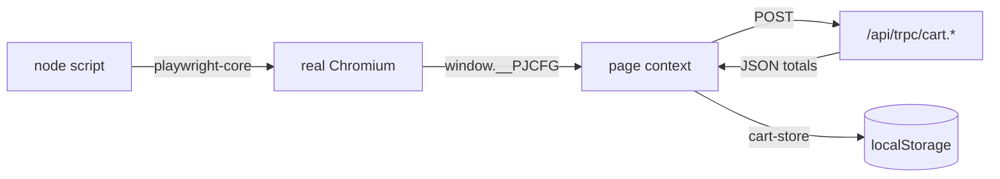

# 🍕 pj-fast — Papa John's carryout optimization


[](LICENSE)

> [!CAUTION]
> Recon tooling only. These scripts build and price carts — they never submit
> checkout, never pay, never place an order. The one real order attempt in
> this repo's history died at checkout; see
> [the failure log](docs/failure-log-2026-09-20.md).

## Contents

- [What is this?](#what-is-this)
- [Quickstart](#quickstart)
- [How it works](#how-it-works)
- [Verified routes](#verified-routes)
- [Promo & deal catalog](#promo--deal-catalog)
- [Configuration](#configuration)
- [Repo map](#repo-map)
- [Docs](#docs)
- [Roadmap](#roadmap)
- [Anti-bot notes](#anti-bot-notes)
- [Backup context](#backup-context)
- [License](#license)

## What is this?

50 Playwright scripts that reverse-engineered Papa John's ordering site down
to its [tRPC API](https://www.papajohns.com/api/trpc/) and found the cheapest
verified carryout carts under $30 for two hungry adults — including a
**$27.11** BOGO Philly Cheesesteak build. No browser UI automation for the
cart itself: real Chromium executes the site's own JavaScript, and the scripts
call `cart.*` procedures directly from page context.

## Quickstart

```bash
cp .env.example .env   # fill in your ZIP / store / paths
npm install
node yote-stage38.js   # rebuild the verified $27.11 BOGO cart
```

> [!TIP]
> `.env` is gitignored — machine-specific values (`PJ_BASE_DIR`,
> `PJ_CHROMIUM_PATH`) differ per box, so set them per machine.

## How it works



Each stage launches Chromium, injects config as `window.__PJCFG` via
`page.addInitScript`, then drives the site's own tRPC mutations from
`page.evaluate` — reading XHR traffic first (stages 1–29), then calling the
API directly (stages 30–49). Full protocol reference:
[docs/architecture.md](docs/architecture.md).

## Verified routes

Store 1054, Denver — validated live 2026-09-20.[^1]

| Route | Deal | Build | Total |
|---|---|---|---|
| 1 — BOGO ✅ | `66564` / `BOGO4U` | Large Philly (no onion + jalapeño) + Large Pepperoni | **$27.11** |
| 2 — EDS8L ✅ | `47851` / `EDS8L` | Large Philly (no onion + jalapeño) | **$18.43** |
| 3 — Pairings ✅ | `65515` / `EDMWP7` | 3× Medium Pepperoni @ $6.99 | **$22.75** |

$\text{savings} = \text{regular} - \text{subtotal}$ — route 3 banks the most
absolute savings ($31.50 off $52.47); route 1 is the best Philly-per-dollar.

## Promo & deal catalog

<details>
<summary><strong>Validated promo codes</strong> (click to expand)</summary>

| Code | Effect |
|---|---|
| `BOGO4U` | BOGO large pizza (deal `66564`) |
| `SM25` / `TAKE25DEAL` | 25% off regular menu — **$0.00 on deal carts** |
| `PEPSI20` / `AMAC20` | 20% off |
| `EDCYO22` | 22% off |

Rejected: `LOC40`, `FREEDELIVERY`, `AE23`, `PSI20`, `PAPATRACK`, `PEPSI25`,
`HONOR25`, `CHOOSEBETTER`.

</details>

Full tables with subtotals, tax, and savings: [docs/deals.md](docs/deals.md).

## Configuration

All tunables live in `.env`, exposed through [`config.js`](config.js):

- **Node side:** `const CFG = require('./config')` → `CFG.STORE_ID`, `CFG.DEAL_BOGO`, …
- **In `page.evaluate`:** config arrives as `P` — e.g. `dealId: P.DEAL_BOGO`, `promoCode: P.PROMO_BOGO4U`.
- **Paths:** `CFG.outDir('out48')` / `CFG.storage('out48/storage.json')` resolve under `PJ_BASE_DIR`.

<details>
<summary><strong>Full key reference</strong> (click to expand)</summary>

| Key | Default | What |
|---|---|---|
| `SITE_URL` | `https://www.papajohns.com` | Site base |
| `STORE_ID` | `1054` | Validated store |
| `ZIP` | `80234` | Search ZIP |
| `BASE_DIR` | `/home/toxic/pj` | Artifact root |
| `CHROMIUM_PATH` | `/usr/bin/chromium` | Browser binary |
| `USER_AGENT` | Chrome/126 Win64 | Request UA |
| `VIEWPORT_W` / `VIEWPORT_H` | `1366` / `900` | Viewport |
| `LOCALE` / `TIMEZONE` | `en-US` / `America/Denver` | Browser locale |
| `SKU_PHILLY_LARGE` | `1-1-4-198` | Large Philly SKU |
| `SKU_PEPP_LARGE` | `1-1-4-115` | Large pepperoni SKU |
| `SKU_PEPP_MEDIUM` | `1-1-3-115` | Medium pepperoni SKU |
| `SKU_WINGS_6PC` | `9-390-8-223` | 6pc wings SKU |
| `SKU_GARLIC_KNOTS` | `12-519-10-202` | Garlic knots SKU |
| `TOPPINGS_PHILLY` | `47,54,506,29` | Philly: onion(25) out, jalapeño(29) in |
| `TOPPINGS_PEPPERONI` | `35` | Pepperoni topping id |
| `SAUCE_PHILLY` / `SAUCE_PEPPERONI` | `428` / `429` | Sauce ids |
| `CONFIG_PHILLY_LARGE` | `16607` | Philly product config |
| `CONFIG_PEPP_LARGE` | `29630` | Pepperoni product config |
| `CONFIG_PAIRING_A/B/C` | `10399/13664/18899` | Pairings slot configs |
| `CONFIG_KNOTS` | `27247` | Knots config |
| `DEAL_BOGO` / `DEAL_EDS8L` / `DEAL_PAIRINGS` | `66564/47851/65515` | Deal ids |
| `PROMO_*` | `BOGO4U`, `SM25`, … | Promo code strings |

</details>

## Repo map

```
pj-fast/
├── [README.md](README.md)                  ← you are here
├── [LICENSE](LICENSE)                        MIT
├── [config.js](config.js)                    env → CFG / window.__PJCFG
├── [.env.example](.env.example)              safe template (never commit .env)
├── [package.json](package.json)              playwright-core + dotenv
├── stage1.js · yote-stage1.js … yote-stage49.js   the 50 recon stages
└── [docs/](docs/stages.md)
    ├── [architecture.md](docs/architecture.md)   tRPC surface, payload shapes, diagrams
    ├── [deals.md](docs/deals.md)                 verified routes + promo catalog
    ├── [stages.md](docs/stages.md)               what each stage does
    ├── [failure-log-2026-09-20.md](docs/failure-log-2026-09-20.md)  the order that died
    └── [assets/banner.png](docs/assets/banner.png)
```

## Docs

| Doc | What's inside |
|---|---|
| [architecture.md](docs/architecture.md) | tRPC procedures, `addToCartWithDeal` payload shape, cart-store key, sequence diagram, sharp edges |
| [deals.md](docs/deals.md) | Route totals with tax/savings math, accepted vs rejected promos |
| [stages.md](docs/stages.md) | All 50 stages, grouped by phase, from their own header comments |
| [failure-log-2026-09-20.md](docs/failure-log-2026-09-20.md) | The real order attempt: wrong store, 3 checkout failures, cancellation |

## Roadmap

- [x] BOGO Philly route verified ($27.11)
- [x] EDS8L Philly route verified ($18.43)
- [x] Papa Pairings max-food route verified ($22.75)
- [x] Promo code validation sweep
- [ ] Philly + filling sides combined total (direct side-add returns `CONFLICT` — unresolved)
- [ ] Re-validate for Broomfield store 1055 (all pricing is store 1054)

## Anti-bot notes

> [!WARNING]
> Plain `curl` gets an Akamai "Technical Difficulties — WD-NS" failover page.
> `curl_cffi` with Chrome impersonation reaches the real site; real Chromium
> via `playwright-core` works throughout. Don't bother with raw HTTP.

## Backup context

The recon above fed a real order attempt on 2026-09-20 that died at checkout
— wrong store staged, three identical site-side "Place order" failures, then
cancelled by Chris. Full timeline:
[docs/failure-log-2026-09-20.md](docs/failure-log-2026-09-20.md). Contact
details redacted; nothing here can place an order.

## License

[MIT](LICENSE) © 2026 toxicwind.

[^1]: All pricing was validated for store 1054 (2683 E 120th Ave, Denver),
    not the originally intended Broomfield 1055 — the order died before
    Broomfield pricing was captured.
