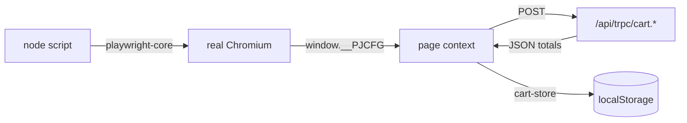

# 🍕 pj-fast — Papa John's carryout optimization

<div align="right">


[](LICENSE)

</div>

> [!CAUTION]
> Recon tooling only. These scripts build and price carts — they never submit
> checkout, never pay, never place an order. The one real order attempt in
> this repo's history died at checkout; see
> [the failure log](docs/failure-log-2026-09-20.md).

## Why should you care?

50 Playwright scripts reverse-engineered Papa John's ordering site down to its
[tRPC API](https://www.papajohns.com/api/trpc/) and found the cheapest verified
carryout carts under $30 for two hungry adults — including a **$27.11** BOGO
Philly Cheesesteak build. No browser UI automation for the cart itself: real
Chromium executes the site's own JavaScript, and the scripts call `cart.*`
procedures directly from page context.

**License:** [MIT](LICENSE) · **Security:** recon-only by design — nothing here can place an order

## Features

- **Verified cheap carts** — three routes validated live 2026-09-20 at store 1054, Denver: $27.11 BOGO Philly, $18.43 EDS8L Philly, $22.75 Pairings
- **Direct tRPC calls** — stages 30–49 skip the UI and call `/api/trpc/cart.*` from `page.evaluate` after stages 1–29 mapped the XHR surface
- **Promo code validation sweep** — accepted vs rejected codes with per-code effects (`BOGO4U`, `SM25`, `PEPSI20`, …)
- **Frozen recon history** — all 50 stages preserved in `archive/stages/` with per-stage header comments
- **Per-machine config** — `.env` → `config.js` → `window.__PJCFG` injection, gitignored by default

## How it works


```mermaid
flowchart LR
    A[node script] -->|playwright-core| B[real Chromium]
    B -->|window.__PJCFG| C[page context]
    C -->|POST| D["/api/trpc/cart.*"]
    D -->|JSON totals| C
    C -->|cart-store| E[(localStorage)]
```

Each stage launches Chromium, injects config as `window.__PJCFG` via
`page.addInitScript`, then drives the site's own tRPC mutations from
`page.evaluate`. Full protocol reference:
[docs/architecture.md](docs/architecture.md).

## Quick start

```bash
npm install
node pj.js bogo        # rebuild the verified $27.11 BOGO cart
node pj.js --help      # all commands
```

(`cp .env.example .env` first — machine-specific values like `PJ_BASE_DIR` and
`PJ_CHROMIUM_PATH` differ per box. `.env` is gitignored.)

| Command | What it does |
|---|---|
| `node pj.js bogo` | Build the verified **$27.11** BOGO cart (Philly + pepperoni) |
| `node pj.js eds8l` | Build the verified **$18.43** EDS8L cart |
| `node pj.js pairings` | Build the verified **$22.75** Pairings cart |
| `node pj.js promos [CODES...]` | Validate promo codes for this store |
| `node pj.js cart` | Show current cart + totals |
| `node pj.js clear` | Empty the cart |
| `node pj.js menu` | Dump store menu categories + products |
| `node pj.js setup` | (Re)run store setup, save session |

## Verified routes

Store 1054, Denver — validated live 2026-09-20.[^1]

| Route | Deal | Build | Total |
|---|---|---|---|
| 1 — BOGO ✅ | `66564` / `BOGO4U` | Large Philly (no onion + jalapeño) + Large Pepperoni | **$27.11** |
| 2 — EDS8L ✅ | `47851` / `EDS8L` | Large Philly (no onion + jalapeño) | **$18.43** |
| 3 — Pairings ✅ | `65515` / `EDMWP7` | 3× Medium Pepperoni @ $6.99 | **$22.75** |

Route 3 banks the most absolute savings ($31.50 off $52.47); route 1 is the best
Philly-per-dollar.

<details>
<summary><strong>Validated promo codes</strong> (click to expand)</summary>

| Code | Effect |
|---|---|
| `BOGO4U` | BOGO large pizza (deal `66564`) |
| `SM25` / `TAKE25DEAL` | 25% off regular menu — **$0.00 on deal carts** |
| `PEPSI20` / `AMAC20` | 20% off |
| `EDCYO22` | 22% off |

Rejected: `LOC40`, `FREEDELIVERY`, `AE23`, `PSI20`, `PAPATRACK`, `PEPSI25`,
`HONOR25`, `CHOOSEBETTER`.

</details>

Full tables with subtotals, tax, and savings: [docs/deals.md](docs/deals.md).

## Architecture

```
pj-fast/
├── README.md                    ← you are here
├── LICENSE                      MIT
├── config.js                    env → CFG / window.__PJCFG
├── .env.example                 safe template (never commit .env)
├── package.json                 playwright-core + dotenv
├── pj.js                        CLI: bogo · eds8l · pairings · promos · cart · clear · menu · setup
├── lib/
│   ├── session.js               Chromium session, __PJ helpers, store setup
│   ├── cart.js                  cart ops via window.__PJ (empty/add/validate/menu)
│   └── deals.js                 verified product/deal payload builders
├── archive/stages/              the 50 recon stages (frozen history)
└── docs/
    ├── architecture.md          tRPC surface, payload shapes, sequence diagram
    ├── deals.md                 verified routes + promo catalog
    ├── stages.md                all 50 stages, grouped by phase
    └── failure-log-2026-09-20.md  the real order attempt that died at checkout
```

## Configuration

All tunables live in `.env`, exposed through [`config.js`](config.js):

- **Node side:** `const CFG = require('./config')` → `CFG.STORE_ID`, `CFG.DEAL_BOGO`, …
- **In `page.evaluate`:** config arrives as `P` — e.g. `dealId: P.DEAL_BOGO`, `promoCode: P.PROMO_BOGO4U`
- **Paths:** `CFG.outDir('out48')` / `CFG.storage('out48/storage.json')` resolve under `PJ_BASE_DIR`

Key knobs: `SITE_URL`, `STORE_ID` (1054), `ZIP` (80234), `BASE_DIR`, `CHROMIUM_PATH`,
`USER_AGENT`, `VIEWPORT_W/H`, `LOCALE`, `TIMEZONE`, SKU/deal/promo ids. Full key
reference: [`config.js`](config.js) and `.env.example`.

## Roadmap

- [x] BOGO Philly route verified ($27.11)
- [x] EDS8L Philly route verified ($18.43)
- [x] Papa Pairings max-food route verified ($22.75)
- [x] Promo code validation sweep
- [ ] Philly + filling sides combined total (direct side-add returns `CONFLICT` — unresolved)
- [ ] Re-validate for Broomfield store 1055 (all pricing is store 1054)

> [!WARNING]
> Plain `curl` gets an Akamai "Technical Difficulties — WD-NS" failover page.
> `curl_cffi` with Chrome impersonation reaches the real site; real Chromium
> via `playwright-core` works throughout. Don't bother with raw HTTP.

## License & security

[MIT](LICENSE) © 2026 toxicwind. Recon-only: scripts build and price carts and
cannot submit checkout. The 2026-09-20 order attempt failed at checkout
(wrong store staged, three site-side "Place order" failures) — full timeline in
[docs/failure-log-2026-09-20.md](docs/failure-log-2026-09-20.md). Contact
details redacted.

[^1]: All pricing was validated for store 1054 (2683 E 120th Ave, Denver),
    not the originally intended Broomfield 1055 — the order died before
    Broomfield pricing was captured.
