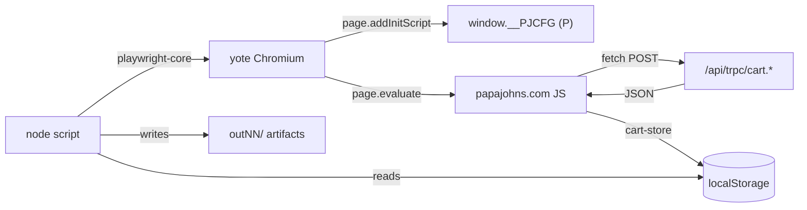
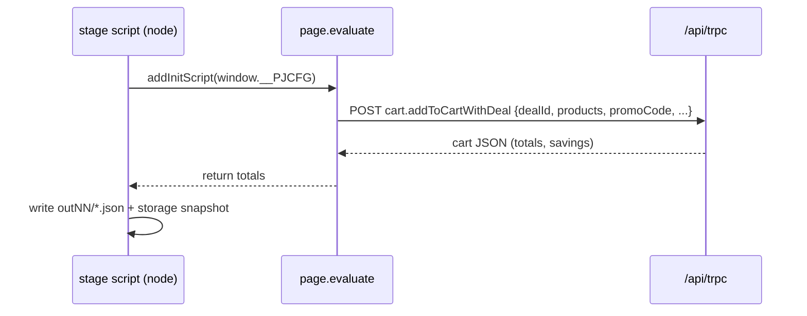

# Architecture

How `pj-fast` talks to Papa John's: no browser UI automation for the cart
itself — real Chromium (via `playwright-core`) executes the site's own
JavaScript, and the scripts call the site's **tRPC API** directly from page
context.

## The tRPC surface

Base: `https://www.papajohns.com/api/trpc/`

Cart state lives in `localStorage` under the key `cart-store`.

### The reliable mutation

`cart.addToCartWithDeal` — the workhorse for every verified route. Fields:

| Field | Meaning |
|---|---|
| `currentCartState` | Cart snapshot the server validates against |
| `dealId` | Numeric deal id (e.g. `66564`, `47851`, `65515`) |
| `products` | Array of configured products (SKU + topping/config ids) |
| `quantity` | Item quantity |
| `promoCode` | Promo string (e.g. `BOGO4U`) |
| `vendorRewardId` | Rewards id (empty when unused) |

### Other observed procedures

| Procedure | Use |
|---|---|
| `cart.addToCart` | Standalone item add (sides — finicky, see below) |
| `cart.applyPromoCode` | Apply a promo to the current cart |
| `cart.refreshItemsInCart` | Re-read cart after mutation |
| `cart.removeFromCart` | Remove a line item |
| `cart.removePromoCode` | Drop the applied promo |
| `cart.updateCartItem` | Update quantity/config of a line |
| `cart.updateCartWithDealItem` | Update an item inside a deal |
| `cart.validatePromoCode` | Check a promo without applying |
| `deals.getDeal` | Fetch deal definition by id |

> [!NOTE]
> `cart.submitPromoCode` appears in bundle text but returns 404 — no such
> procedure. Papa Pairings requires the **numeric** deal id (`65515`), not the
> promo string.

### Known sharp edges

- **Standalone sides vs deals.** Direct `cart.addToCart` calls for sides with
  guessed payloads return `CONFLICT`. The reliable path for sides is
  deal-scoped (Papa Pairings) or captured from a real button click
  (see `yote-stage45.js`).
- **Two pizzas + Garlic Knots** was rejected as an invalid deal and emptied
  the cart — pairings are pizza-only slots.
- **Anti-bot wall.** Plain `curl` hits an Akamai "Technical Difficulties —
  WD-NS" failover page. `curl_cffi` with Chrome impersonation reaches the
  real site (HTTP 200); real Chromium via `playwright-core` works throughout.

